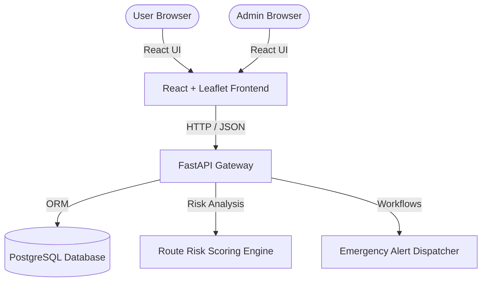

# SafeHer — Women Safety Route & Emergency Alert Platform

A modern, full-stack safety-assist platform that leverages a **dynamic risk-scoring engine** to recommend safer routes, monitors active trips in real time, and orchestrates automated emergency workflows.

🌐 **Live Web Application:** [Open SafeHer Web App](https://safeher-gules.vercel.app)  
⚙️ **Production API:** [Access API Endpoint](https://safeher-backend-f8ti.onrender.com/api/) | [Interactive Swagger Docs](https://safeher-backend-f8ti.onrender.com/docs)  
📦 **GitHub Repository:** [girish50/SafeHer](https://github.com/girish50/SafeHer)

---

## Table of Contents
- [Core Features](#core-features)
- [System Architecture](#system-architecture)
- [Project Directory Structure](#project-directory-structure)
- [Manual Local Development](#manual-local-development)
  - [Prerequisites](#prerequisites)
  - [Backend Setup (FastAPI)](#backend-setup-fastapi)
  - [Frontend Setup (React + Vite)](#frontend-setup-react--vite)
- [Quick Start with Docker](#quick-start-with-docker)
- [Route Risk Hashing & Scoring Engine](#route-risk-hashing--scoring-engine)
- [Limitations & Future Roadmap](#limitations--future-roadmap)

---

## Core Features

### 👤 User Workflows
* **Safer Route Recommendation:** Input starting points and destinations on an interactive map. The engine calculates and highlights the lowest-risk route.
* **Live Trip Monitoring:** Simulates real-time GPS coordinates along the selected route with integrated safety checks.
* **Route Deviation Detection:** Triggers an alert sequence if the user drifts more than 250 meters from the planned route.
* **Prolonged Stop Detection:** Monitors stationary states and triggers safety prompts if inactive for more than 8 minutes during a trip.
* **Interactive SOS Trigger:** A persistent, floating SOS button that initiates an immediate emergency broadcast.
* **Trusted Contacts Directory:** Manage emergency contacts to receive simulated alerts.
* **Trip & Alert History:** Log files tracking historical routing risk indexes and security alert occurrences.

### 🛡️ Admin Dashboard
* **Real-time Analytics:** Visual KPIs tracking active trips, registered users, and system-wide alert frequency.
* **Dynamic Risk Zone Management:** Complete CRUD interface to create and modify high-risk coordinate boundaries.
* **Emergency Support Directory:** Manage emergency support coordinates (e.g., Police Outposts, Hospitals, Safe Havens) rendered on the user-facing map.

---

## System Architecture



* **Frontend:** Single Page Application (SPA) powered by React 18, React Router v6, Leaflet Maps, and custom responsive styling.
* **Backend:** REST API powered by FastAPI (Python 3.11) with automated OpenAPI documentation generation.
* **Database:** PostgreSQL 16 managed via SQLAlchemy 2.0 ORM.
* **Auth:** Secure JWT-based session token authentication with bcrypt password hashing.

---

## Project Directory Structure

```
safeher/
├── backend/
│   ├── app/
│   │   ├── core/
│   │   │   └── security.py      # JWT authentication & bcrypt hashing
│   │   ├── models/              # SQLAlchemy database ORM models
│   │   │   ├── admin.py
│   │   │   ├── alert.py
│   │   │   ├── risk_zone.py
│   │   │   ├── trip.py
│   │   │   ├── trusted_contact.py
│   │   │   └── user.py
│   │   ├── routers/             # FastAPI endpoint route controllers
│   │   │   ├── admin.py
│   │   │   ├── alerts.py
│   │   │   ├── auth.py
│   │   │   ├── contacts.py
│   │   │   ├── support_points.py
│   │   │   └── trips.py
│   │   ├── schemas/             # Pydantic validation & data serializer schemas
│   │   │   ├── admin.py
│   │   │   ├── alert.py
│   │   │   ├── contact.py
│   │   │   ├── trip.py
│   │   │   └── user.py
│   │   ├── services/            # Logical core services
│   │   │   ├── alert_service.py # SOS dispatch and notification workflows
│   │   │   └── risk_engine.py   # AI/logic scoring engine for safe routing
│   │   ├── database.py          # SQLAlchemy engine & session manager
│   │   ├── main.py              # Application entrypoint & CORS config
│   │   └── seed.py              # Seeding script for admin and support markers
│   ├── Dockerfile
│   └── requirements.txt         # Pinned python dependencies
├── frontend/
│   ├── public/
│   ├── src/
│   │   ├── api/
│   │   │   └── client.js        # Axios instance configured with tokens
│   │   ├── components/          # Reusable layout UI components
│   │   │   ├── AdminLayout.jsx
│   │   │   ├── Layout.jsx
│   │   │   ├── RiskBadge.jsx
│   │   │   └── RiskDial.jsx
│   │   ├── context/             # Global Contexts (Auth, UI Toast notifications)
│   │   │   ├── AuthContext.jsx
│   │   │   └── ToastContext.jsx
│   │   ├── pages/               # Routed pages for User & Admin dashboards
│   │   │   ├── admin/
│   │   │   │   ├── AdminAlerts.jsx
│   │   │   │   ├── AdminDashboard.jsx
│   │   │   │   ├── AdminLogin.jsx
│   │   │   │   ├── AdminRiskZones.jsx
│   │   │   │   └── AdminSupportPoints.jsx
│   │   │   ├── ActiveTrip.jsx
│   │   │   ├── AlertHistory.jsx
│   │   │   ├── EmergencySupport.jsx
│   │   │   ├── Login.jsx
│   │   │   ├── PlanTrip.jsx
│   │   │   ├── Profile.jsx
│   │   │   ├── Register.jsx
│   │   │   ├── RouteOptions.jsx
│   │   │   ├── TripHistory.jsx
│   │   │   └── TrustedContacts.jsx
│   │   ├── App.jsx              # Main routing hub
│   │   ├── index.css            # Base styles & CSS design tokens
│   │   └── main.jsx
│   ├── Dockerfile
│   ├── nginx.conf               # SPA rewrite rules for production
│   ├── package.json
│   └── vercel.json              # Vercel deployment rewrite rules
└── docker-compose.yml           # Local multi-container development configuration
```

---

## Manual Local Development

### Prerequisites
* **Python** (v3.10 or higher)
* **Node.js** (v18 or higher)
* **PostgreSQL** (running locally on port `5432` with a database named `safeher_db`)

### Backend Setup (FastAPI)

1. **Navigate to the backend directory and create a virtual environment:**
   ```bash
   cd backend
   python -m venv venv
   ```

2. **Activate the virtual environment:**
   * **Windows:**
     ```bash
     venv\Scripts\activate
     ```
   * **macOS/Linux:**
     ```bash
     source venv/bin/activate
     ```

3. **Install python dependencies:**
   ```bash
   pip install -r requirements.txt
   ```

4. **Configure Environment Variables:**
   Create a `.env` file in the root of the `backend` folder (or set them in your terminal shell):
   ```env
   DATABASE_URL=postgresql://<user>:<password>@localhost:5432/safeher_db
   SECRET_KEY=generate-a-secure-long-string-for-jwt-signing
   ```

5. **Seed the database:**
   Populate the database with a default administrator account, geographic risk zones, and hospital/police markers:
   ```bash
   python -m app.seed
   ```
   *Default Admin Login:* `admin@safeher.demo` / `Admin@12345`

6. **Start the API Server:**
   ```bash
   uvicorn app.main:app --reload --port 8000
   ```
   The backend will be available at `http://localhost:8000` with documentation at `http://localhost:8000/docs`.

---

### Frontend Setup (React + Vite)

1. **Navigate to the frontend directory:**
   ```bash
   cd ../frontend
   ```

2. **Install Node packages:**
   ```bash
   npm install
   ```

3. **Run the Vite development server:**
   ```bash
   npm run dev
   ```
   Open `http://localhost:5173` in your browser. (The API calls will default to the local backend running on port `8000` unless `VITE_API_URL` is set).

---

## Quick Start with Docker

To spin up the database, API server, and React client with a single command:

1. Ensure **Docker Desktop** is running.
2. In the project root directory, run:
   ```bash
   docker compose up --build
   ```
3. Access the frontend app at `http://localhost`.

---

## Route Risk Hashing & Scoring Engine

The risk rating of any route generated by the platform is evaluated using a composite weighted index of safety-critical indicators.

The overall risk index is calculated as:

\[
\text{Route Risk Score} = (R_{\text{zone}} \times 0.35) + (T_{\text{night}} \times 0.20) + (I_{\text{isolation}} \times 0.20) + (P_{\text{support}} \times 0.15) + (D_{\text{duration}} \times 0.10)
\]

### Scoring Weight Breakdown

| Parameter | Weight | Description |
| --- | --- | --- |
| **Risk Zone Interaction ($R_{\text{zone}}$)** | 35% | Proximity and degree of overlap with administrator-defined high-risk boundaries. |
| **Night Travel ($T_{\text{night}}$)** | 20% | Penalty applied if the trip occurs between 8:00 PM and 5:00 AM. |
| **Isolation Coefficient ($I_{\text{isolation}}$)** | 20% | Factored by localized footfall density metrics. |
| **Support Penalty ($P_{\text{support}}$)** | 15% | Distance to the nearest police outpost or hospital marker (lower distance reduces penalty). |
| **Exposure Duration ($D_{\text{duration}}$)** | 10% | The duration of time the traveler is exposed on the route. |

### Score Range Reference
* **0–30:** Low Risk (Rendered in Green)
* **31–60:** Moderate Risk (Rendered in Amber)
* **61–100:** High Risk (Rendered in Red)

---

## Limitations & Future Roadmap

* **Alert Delivery:** SMS and Email dispatches are simulated. In a production build, integrate Twilio (for SMS) and SendGrid (for emails) inside `backend/app/services/alert_service.py`.
* **GPS simulation:** Active trips use simulated GPS coordinate steps. Real-world client integrations should utilize the browser Geolocation API or native mobile GPS hooks.
* **Synthetic Routes:** Route pathways are synthesized into 3 candidate paths. For real road-following navigation, integrate routing backends like OSRM or the Google Directions API.
